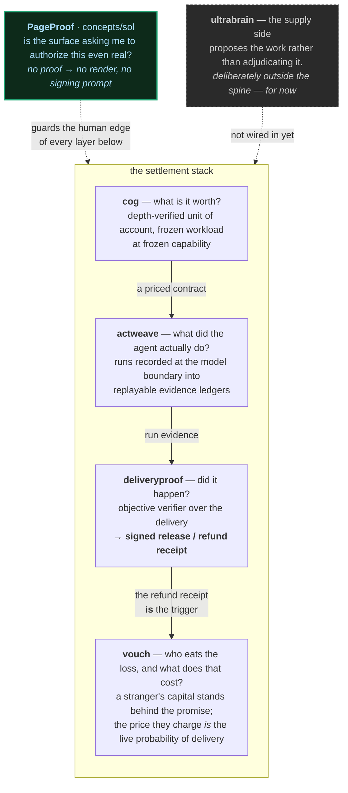

# ThinkTank

**ProofOfWorks' concept lab (stuff that needs to get out of our heads) — a monorepo of inventions: sparred, prototyped, verdicted.** 


Every concept here follows the same lifecycle:

1. **Spar** — the idea is attacked before it is built (peer-debated, prior art mapped, weakest leg named).
2. **Prototype** — the smallest complete instance that can prove or kill the thesis, built from scratch.
3. **Verdict** — an honest call: what held, what didn't, what it's worth, what to stop doing.

Nothing in this repo is a product. Status is explicit; verdicts include the negative parts.

## The house thesis: receipts over vibes

AI is becoming cheap, fluent, and unaccountable. Our concepts cluster around making it
*provable*: verified delivery of work, verified price of cognition, verified memory of facts.
Language at the edges, verification at the core.

---

## How it fits together

Most of this repo is not a set of separate bets. It is **one settlement stack for machine work**,
assembled from the outside in — each layer answering the question the layer beneath it cannot.



### Read it as a single transaction

A buyer pays **4 USDC** for a market signal and trades **5,000 USDC** on the answer.

- **cog** priced the job against a frozen workload at frozen capability, so "4 USDC" means something
  stable as models get cheaper.
- **actweave** recorded what the agent actually did at the model boundary — replayable, so a later
  prompt change becomes a *named failure* instead of a silent pass.
- The agent returns schema-valid but wrong data. **deliveryproof** catches it and refunds the fee.
  It worked perfectly. **The buyer is still out 4,996 USDC.**
- No escrow can close that, because escrow only ever holds the fee. Closing it needs *someone else's*
  capital, committed before the work and priced. That is **vouch** — and DeliveryProof's signed refund
  receipt is literally the trigger it settles on. Bill of lading, then marine insurance; shipping
  needed both.
- And every one of those steps ends with a human clicking approve on a webpage. If that page can be
  swapped in transit, the whole stack underneath is decoration. That is **PageProof**.

The composition is real, not aspirational: vouch consumes DeliveryProof through an injected adapter
(`createDeliveryProofAdapter(dp)`) rather than an import, so it carries zero dependencies and does
not break when DeliveryProof changes.

### The one invariant they all share

Every layer **fails closed**. Absence of proof is never treated as proof.

| Layer | What it refuses to do |
|---|---|
| **cog** | price capability that hasn't passed the exam gate |
| **actweave** | let prompt / tool / tool-result drift pass as green |
| **deliveryproof** | capture funds on a failing verdict |
| **vouch** | settle by claims process or vote — only a deterministic verifier over a receipt |
| **PageProof** | render, or allow a signing prompt, without a valid proof |

This is the actual through-line, and it's sharper than "receipts over vibes": *a system that cannot
verify must refuse, not warn.* Warnings get clicked through — that's the entire history of internet
security. Most of the prior art we keep finding gets the mechanism right and then makes it fail-open
(see `concepts/sol/README.md` on ERC-7754, which puts the check in exactly the right place and then
lets the user proceed anyway).

### Why ultrabrain sits outside — for now

Everything in the spine *adjudicates* work. ultrabrain *produces* it: LLMs propose, verifiers gate,
ledgers remember. It shares the DNA — the gate-and-ledger core is the same idea — but it is the
supply side of the market the rest of the stack settles, and wiring it in before its own verdict is
written would couple a working stack to an unfinished kernel. It joins when it earns a verdict.

---

## Concepts

| Concept | One-liner | Status | Verdict |
|---|---|---|---|
| [`concepts/cog`](concepts/cog/) | The COG — deflation-native unit of account for AI contracts: 1 cog = depth-verified price of a frozen workload at frozen capability; daily ssh-signed fix, exam-gated qualification, MCP server, hybrid contract riders | **Concept — operating prototype** (fix published daily since 2026-06-09) | Unit sound, 2× novelty-verified (nearest prior art: arXiv "Standard Inference Token"); hybrid fixed-USD+cog is the adoption shape; open: real exam runs, receipted buys, public hosting |
| [`concepts/actweave`](concepts/actweave/) | Record, replay, and govern Vercel AI SDK agents in CI — no API keys: runs recorded at the LanguageModelV3 boundary into JSONL evidence ledgers, replayed through the *real* agent loop; strict request-hashing turns prompt/tool/tool-result drift into named failures; governance (allowlists, budgets, approval gates) leaves audit evidence CI can assert | **Concept — working prototype** (71 tests green against real `ai@6`; keyless runnable example) | v1 — a fifth TS agent framework with testing attached — sparred to death (toy runtime, untested adapters, prompt changes passed green): DOA. v2 pivot to testing-layer-only held: replay-through-the-real-loop works, drift detection inverts golden-fixture rot, governance-with-evidence is unoccupied (TS gap is real — the deterministic primitives live Python-side); open: dogfood fixture from a live provider, official Mastra support, first external user |
| [`concepts/sealedtrial`](concepts/sealedtrial/) | An exam the examiner can't rig: commit the *generator* (not the tests), let one preassigned **future** drand round instantiate the **entire** trial, and score every missing answer as a failure — so nobody chose what was on the exam and nothing can be quietly dropped | **Concept — research brief** (spar phase, nothing built) | Contamination is the *other* trust problem and it's crowded; trust-minimized evaluation is itself occupied (PeerBench, Foresight Arena, Benchlist, zkML, TEE). What survived sparring is narrow: everyone uses randomness to **audit a set someone already chose** — nobody uses it to **create** the set. Novel synthesis, protocol-level, Gate 1 passed *provisionally*. Three of our own claims retracted (no contamination immunity; LLM inference isn't bit-reproducible; receipts don't prove *who* produced an output). Weakest leg is not technical: **nobody has been asked whether they want it** |
| [`concepts/deliveryproof`](concepts/deliveryproof/) | Receipts for delivered work: objective delivery checks produce signed release/refund evidence for rail-neutral settlement | **Concept — working prototype** (v0.10, 310 core + 57 adapter tests green) | The *did-it-happen* half of the house thesis; complements COG's *what-is-it-worth* half. Core invariant (no capture on a failing verdict) survived two adversarial agent passes; those passes found 7 exploitable defects at the *boundaries* — unauthenticated receipts, signed-but-unchecked assurance claims, and a mutable contract handed to seller code — all closed in v0.10 with PoC-derived regressions. Verdict: [`concept/VERDICT.md`](concepts/deliveryproof/concept/VERDICT.md) |
| [`concepts/vouch`](concepts/vouch/) | Permissionless surety for machine work: anyone can underwrite anyone else's promise, settlement is a deterministic verifier over a receipt — never a claims process, never a vote. Closes the consequential-loss gap escrow structurally cannot | **Concept — working prototype** (adversarial proofs in `test/`; runnable `examples/demo-deliveryproof.mjs`) | The gatekeeper still standing in 2026 is *the right to make a credible promise* — a new agent must either rent reputation from a platform that gates it or post capital it doesn't have. vouch lets a stranger's balance sheet substitute, and the premium *is* the market's live probability of delivery — the most valuable output of the system. Runs on no layer, deliberately |
| [`concepts/sol`](concepts/sol/) | **PageProof** — a fail-closed web: pages that prove themselves. On-chain manifest + a client that refuses to render (and refuses to let the page ask you to sign) when the bytes don't match. Serve from Solana for reach, verify on Base where a light client actually exists | **Concept — research brief only** (zero code) | Censorship-resistance is a five-link chain and everyone fixes one; the unfixed link is the last mile, proven twice in 2026 with on-chain records perfectly intact. Closest prior art (ERC-7754) checks in the right place then roots trust in DNS+TLS and is fail-open by spec. Serve-on-Solana / verify-on-Base appears unoccupied. Next step is a one-day latency spike that kills the concept if verification can't sit inside a page load — see [`ROADMAP.md`](concepts/sol/ROADMAP.md) |
| [`concepts/ultrabrain`](concepts/ultrabrain/) | Self-learning local agent kernel: LLMs propose, verifiers gate, ledgers remember, skills improve behavior, Datalog answers with proofs. **Supply side — outside the settlement stack for now** | **Concept — working kernel (WIP)** | Architecture proved; the gate + ledger + proofs are the core, now extended with experience streams, skill memory, and teacher-gated training candidates — headline cost-per-solved-task win not yet measured against a real fine-tune. Sandbox hardening is explicit that a same-address-space candidate can still forge a certificate: sound execution of untrusted code requires the OS capability boundary, not a deny-list |

## Layout

```
concepts/<name>/         self-contained prototype: README, whitepaper, code, docs/
```

ThinkTank is a git/docs monorepo. Package-manager workspaces, when a concept needs
them, live inside that concept directory; for example `concepts/deliveryproof` is
its own npm-workspaces package with `concept/` and `adapters/*`.

A concept graduates out when something earns its own repo; the write-up stays as the trail.
