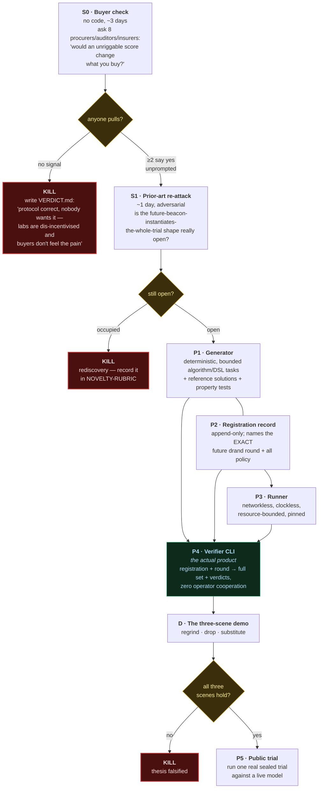
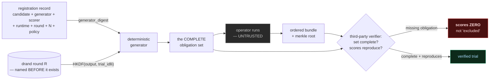
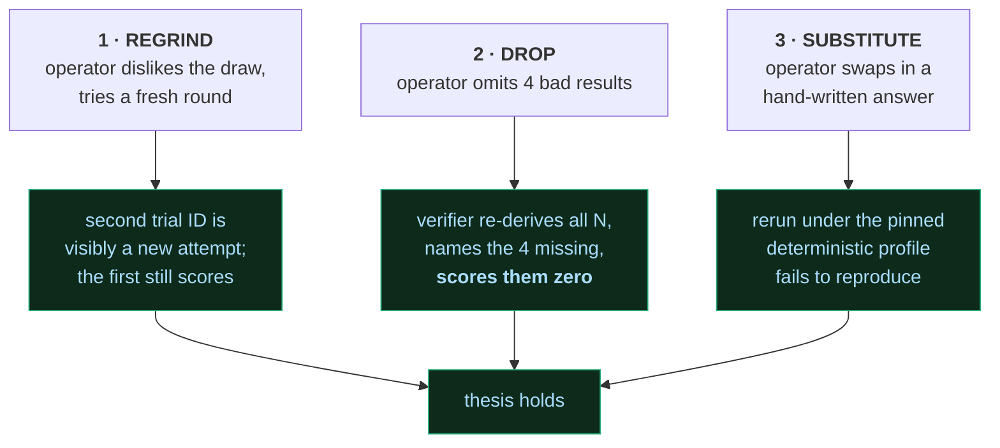

# Sealed Trial — Roadmap

**Status: nothing built. And unusually for this repo, the first gate is not a technical one.**

Companion to [`README.md`](README.md) (the research brief). House lifecycle: **spar → prototype → verdict.**
Kill gates are real. A red node means *stop and write the verdict*, not *try harder*.

---

## 1. The critical path

**Read it as:** three days of conversation decide whether any code gets written. That ordering is
deliberate and it is the lesson from this concept's own history — the protocol survived four rounds
of technical sparring while the buyer question was never once asked.

`P4` is the only node that is a product. Everything before it is scaffolding to reach it honestly.

---

## 2. What the beacon actually buys (the trust chain)

Only two edges carry trust: the **registration was public before round R existed**, and **drand is
honest**. The operator box can be hostile without consequence — which is the entire point.

---

## 3. Phases in detail

| # | Deliverable | Done when | Risk |
|---|---|---|---|
| **S0** | Buyer check | 8 conversations happened and were written down | *this is the whole bet* |
| **S1** | Prior-art re-attack | closest three re-named against current sources | search-fragile by nature |
| **P1** | Generator | same seed ⇒ same task, on two machines, byte-identical | task quality is a human judgement cryptography can't fix |
| **P2** | Registration record | a second implementer could write a valid one from the spec | over-design; keep it to one page |
| **P3** | Runner | no network, no clock, bounded memory/time, hash-pinned | determinism of the *runtime*, not just the generator |
| **P4** | Verifier CLI | reconstructs a full trial from registration + round alone | **if this needs operator cooperation, the concept is dead** |
| **D** | Three-scene demo | all three reproduce on command | — |
| **P5** | Public trial | one real model, one real beacon round, published | needs a willing subject — see weakest leg |

### The three scenes (D)

Scene 2 is the differentiator: **every system in the brief's §2 lets that pass**, because they audit
a sample of what was submitted rather than reconstructing what was owed.

Scene 3 is the honest one — it only holds inside the pinned deterministic profile. Outside it, this
scene cannot be demonstrated, which is exactly the §7 limit made visible.

---

## 4. Do not build

| | Why |
|---|---|
| Another benchmark | this is a protocol for running one honestly, not a new leaderboard |
| A contamination detector | crowded; and it's the *other* trust problem |
| A token / staking layer | core of the nearest patent claim, and it turns an integrity tool into a speculation vehicle |
| A TEE-first design | ~21.7× cost, ~100× slowdown, and it attests execution — not the property we contribute |
| General closed-model support in v0 | property 2 is unsolved there; excluding it is the honest move |

---

## 5. Relationship to DeliveryProof

**Reuse, not a rewrite.** DeliveryProof is the scoring and receipt layer and it is already hardened
(310 tests, v0.10, two adversarial passes).

What crosses over:

- **The invariant.** *No capture on a failing verdict* → **no quiet retry on an unfavourable draw.**
- **Verifier-seeded sampling**, which was built explicitly as an anti-cherry-pick mechanism — the
  same instinct, one layer up.
- **Tier honesty.** Tier A "objective, no third-party trust" maps to properties 1/3/4; property 2
  (execution provenance) is Tier B at best and must be labelled that way.
- **Canonical hashing and signed receipts**, reused directly.

What does *not* cross over: DeliveryProof proves a deliverable was correct. It has no opinion on
*who produced it*. That gap is property 2, and it is not closed by reusing this code.

---

## 6. Named weakest legs

1. **Nobody has been asked whether they want this.** Labs are dis-incentivised to be measured
   this way; procurers and regulators want it but move slowly. `S0` exists because this concept
   survived four rounds of technical sparring without the buyer question being asked once. It is
   the most likely cause of death and the cheapest to test.
2. **Gate 1 passed narrowly and provisionally.** The category — trust-minimized evaluation — is
   occupied. Only the specific protocol shape appears open, and absence of search results is not
   absence of prior art.
3. **Execution provenance is unsolved** and v0 sidesteps it by scope. Any move toward general
   closed models re-opens it immediately, and receipts do not close it.
4. **The generator's distribution is a governance problem, not a cryptographic one.** A sealed
   generator emitting unrepresentative tasks is honestly sampled and worthless. Nothing in this
   protocol detects that.
5. **FTO is screened, not cleared.** US20260141015A1 needs a real claim chart before product work.
