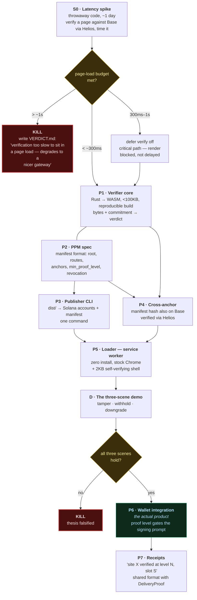
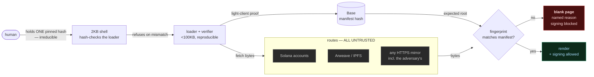
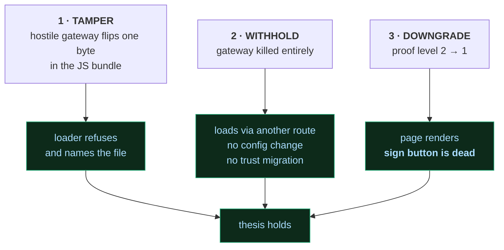
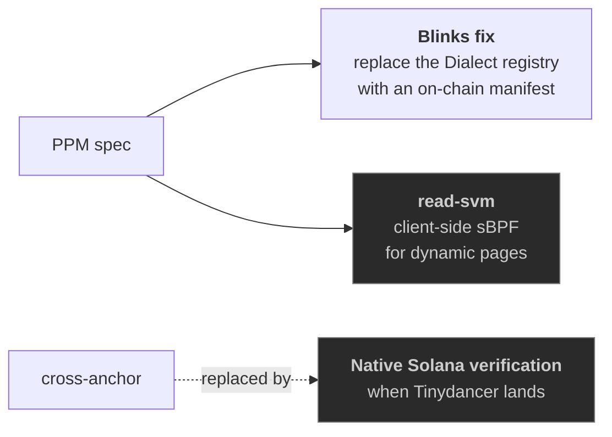

# PageProof — Roadmap

**Status: nothing built. Everything below S0 is contingent on S0.**

Companion to [`README.md`](README.md) (the research brief). House lifecycle: **spar → prototype → verdict.**
Kill gates are real. A red node means *stop and write the verdict*, not *try harder*.

---

## 1. The critical path

**Read it as:** one day of throwaway code decides whether any of the rest is worth writing.
`P6` is the only node that is a product; everything before it is scaffolding to reach it honestly.

---

## 2. What verifies what (the trust chain)

The point of the diagram: **only two edges carry trust** — the human's pinned hash, and the Base
light-client proof. Every other box can be hostile without consequence.

---

## 3. Phases in detail

| # | Deliverable | Done when | Risk |
|---|---|---|---|
| **S0** | Latency spike | a number exists, in a real browser, on a real page | *this is the whole bet* |
| **P1** | Verifier core | given tampered bytes it returns false, given real bytes true, in <100KB WASM | size budget vs. Helios' 5.3MB — may need a trimmed sync-committee-only build |
| **P2** | PPM spec | a second implementer could build against it | over-design; keep it to one page |
| **P3** | Publisher CLI | `pageproof deploy ./dist` puts a real site on devnet | Solana 10 MiB account cap, 10,240-byte realloc steps |
| **P4** | Cross-anchor | manifest hash on Base, verified client-side via Helios | **novel — nobody has done this for frontends** |
| **P5** | Service-worker loader | site loads verified in stock Chrome, no install | SW scope + first-load bootstrap |
| **D** | Three-scene demo | all three scenes reproduce on command | — |
| **P6** | Wallet integration | signing prompt suppressed at proof level < 2 | needs a wallet partner; nothing ships without one |
| **P7** | Receipts | signed evidence line, format shared with DeliveryProof | — |

### The three scenes (D)

Scene 1 is the differentiator: **every system surveyed in the brief renders that page.**

---

## 4. Parallel / optional

- **Blinks fix** — smaller, self-contained, ecosystem-relevant, plausible Solana Foundation pitch.
  A reasonable *first* prototype if PageProof proper is too big a bite.
- **read-svm** — deferred to v2. Static tier proves the thesis; dynamic pages don't change it.
- **Native Solana verification** — cross-anchoring is deliberately a workaround. When Tinydancer
  reaches production, level 2 goes native and **the manifest format doesn't change.** Designed for
  that swap from day one.

---

## 5. Do not build

| | Why |
|---|---|
| A name system | ENS/SNS already win. Namecheap exiting Handshake in June 2026 is the evidence for the alternative |
| A gateway | that's the chokepoint. Make it irrelevant, don't join it |
| A Chromium fork | unmaintainable security liability, and "trust our browser" recreates the relationship we're deleting |
| A validator SIMD / new syscall | reads never need consensus |
| A pinning service | bulk storage should stay a commodity |

---

## 6. Relationship to DeliveryProof

**Patterns, not a dependency.** DeliveryProof is Node ≥22 with a SQLite replay store; PageProof's
verifier is browser WASM under a hard size budget. Coupling them fights the size budget, which *is*
the security argument.

What crosses over:

- **The invariant.** *No capture on a failing verdict* → **no signing prompt on an unproven frontend.**
- **The tier taxonomy.** Tier A "objective, no third-party trust" → light-client proof.
  Tier B "source said X" → RPC quorum. Already survived two adversarial passes; don't re-derive it.
- **The frozen-registry hardening** (`deliveryproof/concept/src/verifiers/index.mjs:38-54`) — freeze
  the registry *and* each verifier object, because identity checks are defeated both by replacing
  the entry and by mutating `.verify` after the check has run. PageProof faces that exact attack,
  with a signing prompt as the prize.
- **Receipt format** (P7), aligned deliberately.

---

## 7. Named weakest legs

1. **S0 is the whole bet.** If verification can't sit in a page load, this is a slower gateway.
2. **P4 is unbuilt and novel.** Cross-anchoring is what routes around Solana's missing light client.
   If it's too slow or too expensive, level 2 is unreachable on Solana and the concept caps at
   "RPC quorum" — a trust assumption dressed as a check.
3. **The bootstrap root is irreducible** (README §6). One human-held hash. Anyone claiming zero is
   selling something.
4. **P6 needs a partner.** The capability gate only matters inside a wallet. No wallet, no product —
   the technical work is necessary but not sufficient, and that's a business risk, not an engineering one.
