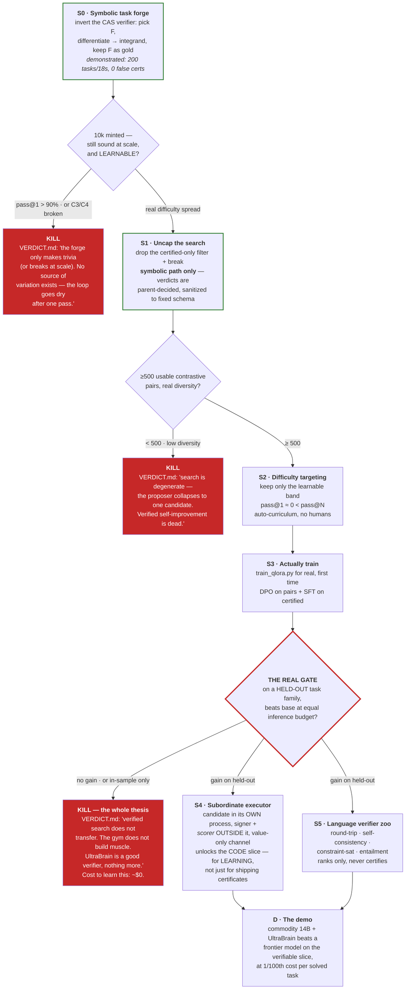

# UltraBrain — Roadmap

**Status: verifier built and hardened. Writer is a museum piece. Trainer has never been run.
Zero evidence of capability gain exists.**

Companion to [`README.md`](README.md) (what is built) and
[`docs/BECOMING_AN_LLM.md`](docs/BECOMING_AN_LLM.md) (why the current shape cannot scale, and the
four assumptions to drop). House lifecycle: **spar → prototype → verdict.** Kill gates are real.
A red node means *stop and write the verdict*, not *try harder*.

---

## 0. The correction this roadmap encodes

The old critical path was **subordinate executor → real fine-tunes**. Everything queued behind a
security fix, and nothing has been learned about whether the core thesis works at all.

Two measurements change the ordering:

1. **The forge is capped at 34 examples and its compute knob is inert.** At `--n 64` it generates
   384 candidates, judges **7**, keeps 6, discards 377 unverified — 176 of them purpose-built hard
   negatives. `--n 8` does identical work. `run_verified_search.py:161` + the `break`.
2. **The symbolic path is sound today and infinitely generative.** `CASVerifier` never executes
   the candidate — AST whitelist, then sympify, verdict decided wholly in the parent, no worker,
   no signed channel. A ~40-line forge minted **200 tasks in 18s: 200/200 golds certified, 595
   distractors, 0 false certifications.**

An earlier draft of this roadmap claimed reject-harvesting on the *code* path was sound because
forgery can only manufacture false accepts. **Codex falsified that** (ledger `c91f536e`): a
correct function forced an authenticated false REJECT, a genuine 0/10 forged a signed 7/10, and
candidate text plus *parent expected values* flow verbatim into `Verdict.detail`. Self-sabotage
is rational when poisoning the next model is the goal. That claim is withdrawn.

> **New critical path: mint tasks where verification never executes (S0) → uncap the search there
> (S1) → aim it (S2) → actually train (S3).** All four are days of work, cost ~$0, and are
> currently sitting behind a security blocker that gates only the *code* slice.

---

## 1. The critical path



---

## 2. The slices

### S0 · Symbolic task forge — *the scaling axis, sound today*

The task list is not the input; it is the output of a verifier run backwards. Pick `F`,
differentiate to get the integrand, keep `F` as a gold **the parent held before the candidate
existed**. No untrusted computation contributes to the label.

Prototype: `scratchpad/forge_probe.py` (~40 lines, real unmodified `CASVerifier`) —
**200 tasks in 18s, 200/200 golds certified, 595 auto-distractors, 0 false certifications, 0
parse errors.** ~11 tasks/sec → 10k tasks in ~15 min on CPU, $0. Against **34 hand-written tasks
in the repo's lifetime.**

**S0b · The grammar is far smaller than I claimed — measured.** "200 tasks in 18s" is true and
"unlimited" is **not**. The shipped `_sample_F` grammar reaches only **3,984 distinct tasks**, and
the distribution is brutally lopsided:

| family | reachable | note |
|---|---|---|
| `poly` | 3,900 | **98% of the entire space** |
| `prod` | 24 | shares `exp` atoms with the `exp` family |
| `trig` | 18 | |
| `exp` | 18 | |
| `chain` | 18 | shares `sin` with `trig` — not a disjoint family |
| `log` | **6** | `a*log(x)`, a∈1..6. That is the whole family |

Three consequences, all mine to fix:

1. **`mint(n)` hangs for n > 3,984.** `while len(out) < n` plus dedup against an exhausted space is
   an infinite loop. A real bug, not a limit — needs bounded attempts and a loud "space exhausted".
2. **A 1,000-task corpus is ~98% polynomial integration.** Training on it teaches the power rule
   and almost nothing else. The transcendental families contribute **84 distinct tasks in total**.
3. **S3's held-out-family gate is thin but not empty.** The families are not disjoint (`chain`⊂`trig`
   via `sin`, `prod`⊂`exp` via `exp`), so the one *genuine* split available is by transcendental
   class: train on `{poly, trig, chain}`, test on `{exp, prod, log}` — "can it integrate
   exponentials and logs having seen only polynomials and trig?" That is a real question, on ~48
   test tasks. Thin. Enrich the grammar before leaning on it.

The inversion principle is unaffected — *a verifier run backwards is still a task generator*. What
is limited is this particular six-branch grammar, which was written to demonstrate the mechanism,
not to carry a corpus. Widening it (more coefficients, nested compositions, integration by parts,
partial fractions, `cas_equivalent` identities) is cheap and is the real S0 work.

Extend along the same inversion: `cas_equivalent` (algebraic identities), then
`verify/scientific.py`'s conservation/unitarity checks (pick an invariant → mint simulation
tasks). Mutation-inverse for code waits for **S4**.

Output is **uncontaminated by construction**, which also retires the in-sample caveat that
currently invalidates the repo's only writer result.

**S0a · Harden the symbolic verifier first** — Codex's adversarial review (ledger `30847b56`)
returned **C3 = BROKEN TODAY, C4 = HOLDS-WITH-CONDITIONS**. The architecture survives — *no
AST-whitelist code-execution bypass was found, and the symbolic path needs no subordinate
executor because candidate code is never executed* — but four local defects must be fixed before
it can mint a trusted corpus:

| # | Defect | Fix |
|---|---|---|
| 1 | `oo`, `log(0)`, `1/0`, `0/0` **certify** as antiderivatives of `0` (sympy differentiates `oo`/`zoo`/`nan` to zero); `0**0 ≡ 1` | reject non-finite/undefined candidates — not the intended removable-singularity slack |
| 2 | Unbounded evaluation **hangs the trusted parent** inside the allowed grammar: `factorial(999999)` (>8s, reproduced), `gamma(10¹²)`, `Float(Rational(1,3),10⁸)`, `factorial(factorial(1000))` → uncaught `RecursionError` | bound text/nodes/depth/arity/cost; resource-limited CAS worker; **timeout ⇒ ABSTAIN** (`Verdict` already supports it) |
| 3 | `detail` **leaks the gold**: candidate `0` vs gold `x**2+3*x+7` → `residual -x**2 - 3*x - 7 != 0` | persist enums/counts/digests only — never residuals or exception text |
| 4 | Unrestricted minting is degenerate: `F=oo` (invalid gold), `F=x-x`/`sin²+cos²` (trivial), `F=floor/gamma/Abs` (derivative outside the verifier grammar → ABSTAIN) | closed finite differentiable grammar + degeneracy rejection + round-trip validation |
| 5 | Uncertain equality is treated as a decision | prefer **exact witnesses**; an inconclusive `.equals`/numeric probe must **ABSTAIN, never reject** — the zoo's own grade-1 rule |

Defects 1 and 4 do not bite the shipped forge — it skips `integrand.is_number` and uses a closed
grammar, which is why it survives at 1000 — but they are live in the **verifier**, so a candidate
can still exploit 1, and any grammar extension re-opens 4.

> **KILL GATE.** Two conditions. *(a)* S0a's four fixes land and the forge stays sound at 10k.
> *(b)* Minted tasks solved at `pass@1 > 90%` are trivia: no variation, no signal, Ceiling 4
> reasserts and the loop goes dry after one pass. **Verified so far:** 1000 minted → 1000/1000
> golds certified, 2995 distractors, **0 false certifications**, 8 tasks/sec.

### S1 · Uncap the search — *symbolic path only*

`gate.py:41` and `run_verified_search.py:161` both filter on `certified`; the `break` makes
`--n` inert. Drop the filter, drop the `break`, append rather than `open(..., "w")`.

Scoped **to the symbolic path**, where the verdict is parent-decided and no candidate code runs.
Emit contrastive pairs — (prompt, certified, rejected) — for DPO.

**Sanitization is mandatory, not optional** (Codex, ledger `c91f536e`): persist only
fixed-schema counts, enums and case digests. **Never** raw child output, exception text, candidate
return strings, or parent expected values — the last leaks the hidden oracle into the training
corpus and destroys the held-out property S3 depends on. The collector should hold no signing
secret at all.

Harvesting on the **code** path is available today only as explicitly `trusted=false`, sanitized,
secrets-free **diagnostics** — useful for testing whether DPO rankings correlate with holdout
performance, but it is not the trusted loop and must never be labelled as one.

> **KILL GATE — CORRECTED, and the correction is the interesting part.** The original gate here
> read "≥500 usable pairs from 34 tasks × N=16." Measured against the real `NoisyProposer`, that
> gate is both unreachable and meaningless, for one reason:
>
> ```
> --n 8 -> 3.10 distinct candidates/task   --n 64 -> 3.50   --n 256 -> 3.50   <- saturates
> ```
>
> For `kind != "code"` the proposer draws from a **fixed pool of {gold} ∪ {3 distractors}** — four
> elements. So uncapping `--n` buys *attempts*, not *variety*: 6 shipped CAS tasks cap at **16
> pairs**; 200 forged tasks reach ~500 only by minting; and across 117 distractors there are just
> **three error archetypes** (`scalar_multiple` 65, `plus_x` 29, `derivative` 23). Five hundred
> pairs encoding three kinds of error is not five hundred units of signal — DPO on it learns three
> lookup entries.
>
> **MEASURED AT SCALE (S1, 200 forged tasks, 1,600 attempts):**
> **405 unique pairs · 550 distinct candidate strings · but only 3 semantic error archetypes**
> (scalar-multiple 211, `+x` 108, derivative 86). The count looks healthy; the signal is three
> rules. Had the original ≥500 gate survived, 405 would have read as "nearly there — mint a few
> more tasks," and at 500 we would have declared success on a corpus teaching three rules.
>
> **Attribution — and this corrects my own first reading.** I said the bottleneck "moves to the
> proposer." That is true of the *future* and false of *this measurement*. With the mock, the
> candidate pool **is** the distractor list, which the forge generates. `_perturb` has exactly four
> rules — `F*k`, `F+x`, `diff(F)`, `F/2` — and `F*k`/`F/2` are both scalar multiples, so **4 rules
> collapse to 3 archetypes**, which is precisely the 3 measured. `NoisyProposer` faithfully sampled
> a pool that was already only three kinds of wrong; it contributed nothing to the poverty.
>
> So **both measured degeneracies trace to the forge**, not the proposer: *task* variety
> (`_sample_F` → 98% polynomial) and *error* variety (`_perturb` → 3 archetypes).
>
> **But they are not the same kind of problem, and only one should be "fixed".**
>
> - **Task variety — widen it.** More coefficients, nested compositions, integration by parts,
>   partial fractions, `cas_equivalent` identities. A real fix, cheap, and it comes before any model.
> - **Error variety — do NOT widen `_perturb`.** That is a category error, and the "fix" would be
>   worse than the three honest archetypes. `_perturb` was written for Slice 1's job — falsifying
>   the *verifier* ("do wrong answers get rejected?"), which wants few, hard, adversarial
>   near-misses. Reading it as *training* signal wants something different: errors representative of
>   what a model actually gets wrong. **You cannot synthesise those by perturbing the gold.** Real
>   integration errors are procedural — a forgotten chain-rule factor, a sign flip on cos→sin, the
>   power rule applied to an exponential — while `F*k`, `F+x`, `diff(F)` are algebraic neighbours of
>   the *answer*, a different distribution entirely. Widening it would manufacture a corpus that
>   *looks* diverse, turn the diversity metric green, and still teach the model to avoid mistakes it
>   never makes. Diverse-looking fake signal is more dangerous than three honest archetypes.
>
> **The real conclusion: synthetic distractors were never going to be the training signal.**
> Contrastive pairs need a real proposer — so S3 is load-bearing rather than an optional upgrade,
> and archetype counts on the mock corpus are a *health warning*, not a metric to optimise.
>
> **So: S1 is a MECHANISM slice, and its gate defers to S3.** Build and test the uncapping,
> appending, pair emission and sanitation with the mock; report pair count *and* distinct-candidate
> / distinct-archetype counts so the number cannot flatter itself; and evaluate the ≥500-diverse-
> pairs gate only once a real proposer is behind it. A regression asserting "attempts scale with
> `--n`" will pass while distinct candidates stay pinned at ~3.5 — that saturation is correct
> behaviour for a fixed-pool proposer, not a failure of the fix.

**The proposer S0–S3 need already exists locally.** The "days, ~$0" estimate quietly assumed a
model to propose with; it checks out. On disk today:

| Model | Licence | Serve with | Use |
|---|---|---|---|
| `mlx-community/Qwen2.5-3B-Instruct-4bit` (1.6 GB, complete) | **Apache-2.0 — clean** | `pip install mlx-lm` → `mlx_lm.server` → `--base_url http://localhost:8080/v1` | **the one to use.** Small is *right* here: a weak proposer makes the learnable band (`pass@1 ≈ 0 < pass@N`) easy to find, and gains are more visible |
| `gemma-4-12B-coder-fable5-composer2.5` GGUF (6.9 GB) | **Gemma + distilled from Fable 5/Composer 2.5 — TAINTED** | `llama-server` (already installed, runs now) | **diagnostics only.** This is the exact model `ULTRABRAIN_CODE_PLAN.md` names as the redistribution trap. Traces from it must never become shippable training data |

The tainted model runs with zero setup and the clean one needs one `pip install`. Take the pip
install — a corpus generated from the tainted model is unusable for the thing this project exists
to ship, and that is discovered too late if it is discovered after training.

### S2 · Difficulty targeting

Keep only tasks in the learnable band — `pass@1 ≈ 0 < pass@N`. Below it, nothing to learn; above
it, hopeless. This is the auto-curriculum, and it converts S0's volume into signal.

### S3 · Actually train — *and the gate that decides everything*

`train_qlora.py` has never run outside `--dry_run`. Run it: DPO on S1's pairs, SFT on certified.

> **THE REAL KILL GATE.** On a **held-out task family** (not a held-out split of the same family),
> does the trained model beat the base **at equal inference budget**? If not — or if the gain is
> in-sample only — the thesis is dead and you learned it for about $0. The project has never
> reached this gate; every slice above exists to reach it cheaply.

### S4 · Subordinate executor — *promoted: it gates learning, not just shipping*

Candidate in its own process; decider, **scorer** and signer outside it; value-only authenticated
channel. Codex's falsification promoted this: without it, *rejects and partial scores* are
forgeable too, so the entire code slice is unusable for training — not merely uncertifiable.

Not a research problem — `subprocess` + a pipe with the oracle and the scoring in the parent. It
has stalled because the fix keeps being attempted **inside** the worker instead of **above** it.

### S5 · Language verifier zoo — *the bridge out of code*

Round-trip reconstruction, self-consistency across paraphrases, constraint satisfaction,
entailment against a cited source. All grade-2/3: they rank, they never certify — and after the
Bias-2 correction that distinction must be enforced in code, not just in prose.

---

## 3. Data sources beyond the forge

The symbolic forge (S0) is unlimited but narrow — it mints mathematics. Three planned documents
cover where *code* tasks come from, in strict build order. **All three sit after S3**: they are
worthless if training on verified tasks turns out not to improve a model, and S3 answers that for
about $0.

| | Doc | What | When |
|---|---|---|---|
| 1 | [`FLIGHT_CORPUS.md`](docs/FLIGHT_CORPUS.md) | design + licence rules for PX4/ArduPilot as a task source. Key move: they are a **mine for specifications and reference vectors**, not a build target — the C++ never runs | after S3 |
| 2 | [`FLIGHT_HARVESTER_PLAN.md`](docs/FLIGHT_HARVESTER_PLAN.md) | the build: gtest parser → task JSONL, ~1–2 weeks. **The pilot** — one repo, one language, known-good suite | after 1 |
| 3 | [`GITHUB_ABSORBER_PLAN.md`](docs/GITHUB_ABSORBER_PLAN.md) | generalise the pilot across repos. Scores repos by **verifiability, not popularity** — and treats popularity as an *anti*-signal, because stars predict contamination | after 2 |

Two rules run through all three: **permissive licences train, copyleft evaluates only** (enforced
in code, not comment), and **every result is reported with its contamination control** — absorbed
data can never be clean by construction, so the forge stays the control it is read against.

## 4. What is deliberately not on this roadmap

- **Pretraining a base model.** Seven orders of magnitude in data, ~8 GPU-years in FLOPs.
  Arithmetically excluded. The base is rented and swapped, not built.
- **The diffusion LM as *the writer*.** It stays as the FIM/infill proposer — the one role where a
  bidirectional denoiser genuinely beats same-scale AR — and nothing more.
- **World knowledge and taste.** No verifier reaches them. Permanently conceded.
- **Sound certification of prose.** S5 ranks; it does not certify, and nothing may imply it does.
- **Any claim that the code path is sound before S4.** Certification, rejection and scoring are
  all forgeable there. Reproduced, not theorised.
