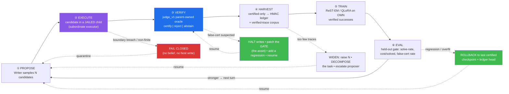
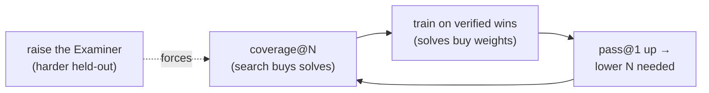
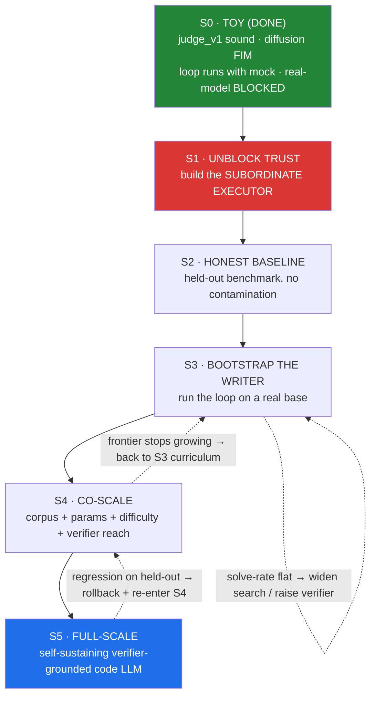

# UltraBrain — Roadmap: the self-improving verifier↔generator loop (toy → full-scale)

> **One idea.** The **Writer** (generator) and the **Examiner** (verifier) are not two projects —
> they are the two halves of a single **closed loop that improves itself without a teacher**. The
> Examiner is the *invariant* that makes self-improvement safe and un-fakeable: **only
> verifier-certified outputs ever become training data**, so the Writer can only ever learn from its
> own *proven* successes. The Writer is what *scales*. This document is that loop — drawn as a graph,
> with the **recovery edges** that keep it from corrupting itself and the **improvement edges** that
> carry it from a toy to a full-scale LLM.
>
> Motto: **no evidence → no trusted belief → no training example.**

This is a plan you *run*, not a list you check off. Each section is a node or an edge of one graph.

---

## 0. Where we are (honest snapshot)

| Half | State today | The gap to "works" |
|---|---|---|
| **Examiner** (`ultrabrain/verify/judge_v1`) | Sound *pattern* (parent-owned oracle + HMAC + fail-closed harness). Certifies trusted/your-own proposers today. | A candidate sharing the worker's process can still forge a signed verdict (`adversarial_soundness=False`, one strict-xfail). Untrusted-model certification is **fail-closed** = blocked. |
| **Writer** (masked-diffusion FIM) | Trains from scratch on a laptop; does infilling; certifies **2/11** code fills through the gate. | That 2/11 is **contaminated** (corpus contains the eval golds). No held-out capability yet. |

The loop **runs today with the zero-ML `mock` proposer** (`self_improve.py`). It is **blocked from
consuming a real model** by exactly one thing (§4, S1). Everything below is the path from that block
to a self-sustaining engine.

---

## 1. The engine — the core loop

The whole system is one cycle. The forward edges *improve*; the dashed edges *recover* (they never
throw trusted state away — they roll back to it).

**Read it as:** the Writer proposes → a **jailed** executor runs the code → the **Examiner** decides →
only *certified* outputs are harvested → the Writer trains on its *own proven wins* → a held-out gate
measures the gain → repeat, stronger. Any anomaly takes a **dashed edge** back to a known-good state
instead of poisoning the corpus.

---

## 2. Why it is *self-recovering* (the invariants)

Recovery is not a feature bolted on; it is what the architecture *is*. Five invariants can never break,
so there is always a known-good state to fall back to:

1. **The trust anchor is data, not weights.** Capability lives in the *verifier* + the append-only,
   tamper-evident **ledger** (`ledger.py`) and the last **certified checkpoint** — not in the model
   weights. So a bad training run is disposable: `ROLLBACK` to the last checkpoint; the ledger is
   untouched. You can lose a model and lose nothing that was *proven*.
2. **The gate fails closed, in isolation.** A suspected false-certification **halts writes**, not the
   system. You patch the *verifier* (the durable asset) and resume — the Writer's weights were never
   the trust boundary, so nothing certified is retroactively at risk. (This is exactly how the
   `judge_v1` rework happened: a vector was found, the gate was fixed, the invariant held.)
3. **No contamination, by construction.** A held-out train/test split is an invariant. If overlap is
   detected, that cycle's data is **quarantined** — never trained on. (The current toy 2/11 violates
   this on purpose, as a smoke test; §5 fixes it.)
4. **Untrusted execution cannot corrupt the loop.** Once the subordinate executor (§4, S1) lands, a
   candidate can neither forge a verdict nor write the host — a poisoned proposal can only be
   *rejected*, never *ingested*.
5. **`abstain` is a first-class outcome.** Undecidable → the loop skips, it does not guess. Uncertainty
   never becomes a trusted belief.

> **Rollback anchor = `(ledger.head(), last_certified_checkpoint)`.** Every node can return here.

---

## 3. Why it is *self-improving* (the ratchet)

Three compounding mechanisms turn each cycle into more capability — with no teacher, hence no ceiling:

- **ReST-EM (train on your own verified wins).** The policy is reinforced *only* on verifier-certified
  successes → improvement is monotone in expectation and cannot drift into unverified behaviour.
- **The verifier is a curriculum generator.** *Raise the Examiner* each cycle — more oracles, harder
  held-out cases, mutation / differential / property tests — and the bar rises, which *forces* the
  Writer up. The asset that guarantees safety is the same asset that sets the next challenge.
- **Coverage → capability → cheaper coverage.** Verified search (sample N, keep any that certify)
  turns a *weak* proposer's coverage into solved tasks **now**; training *internalizes* those wins so
  `pass@1` rises **next** cycle; then N can shrink and cost/solved falls. That is the ratchet:
  **spend search to buy weights, spend weights to buy back search.**

---

## 4. The scale ladder — toy → full-scale (each rung is one turn of the loop, larger)

Every rung has an **ENTRY gate** (what must be true to start), the **LOOP** at that scale, an **EXIT
gate** (a *measured* criterion to advance), and a **RECOVERY** edge (what to do if the exit gate fails —
you never get stuck, you drop back a rung).

### S0 — Toy *(done)*
Parent-owned-oracle gate is sound; the Writer is a from-scratch byte-level diffusion LM; the verified
loop runs with the zero-ML control. **Exit already met.**

### S1 — Unblock trust *(the one real blocker)* 🔴
**Entry:** S0. **Build:** the **subordinate candidate executor** — the candidate runs in its *own*
process; the signer/decider/oracle live *outside* it; they speak only over a **value-only, authenticated
channel** the candidate cannot reach into. Wrap it in a real **host jail** (separate uid / container /
seccomp-no-exec-no-ptrace / no network / read-only mounts).
**Exit gate (measured):** the strict-xfail forgery test *flips to contained*; `adversarial_soundness`
becomes defensible; `run_verified_search --proposer llm/fim` can write trusted traces again.
**Recovery:** if a fully general Python executor can't be made sound, **restrict the task ABI** to a
call-schema / DSL (inputs → values only) — the loop still runs, just over a narrower language.

### S2 — Honest baseline
**Entry:** S1. **Do:** author a **held-out** benchmark (≥ 4 task families, ~50 each) **disjoint** from
any training/trace corpus, with independently-written hidden/property oracles.
**Exit gate:** a real, uncontaminated `pass@1` + coverage@N + **cost-per-solved-task** for (a) the base
coder and (b) the Writer. This replaces the contaminated 2/11 with a number you can trust.
**Recovery:** if the baseline is ~0, shrink task difficulty until the proposer has a foothold (the
26–35% subproblem regime), then decompose.

### S3 — Bootstrap the Writer
**Entry:** S1 + S2. **Do:** run the **full loop** on a real base — Qwen3-Coder-14B behind the proposer
protocol *and/or* the diffusion FIM head — on the RTX 5080: `verified traces → QLoRA → eval → gate`,
each round via `self_improve.py`.
**Exit gate:** held-out solve-rate rises **cycle-over-cycle** (the ratchet turns) with false-cert rate
≈ 0 on an external holdout.
**Recovery:** flat/declining solve-rate → `ROLLBACK` + **widen search** (raise N, decompose) *or*
**raise the verifier** (the curriculum was too easy / too hard). Overfit → rollback + more data / regularize.

### S4 — Co-scale
**Entry:** S3 turning. **Do:** scale the four dials **together** — corpus size, model params, task
difficulty, and **verifier reach** (new sound oracles for the domains you're entering). The verifiable
frontier expands as the Writer does.
**Exit gate:** the *set of tasks the loop can verifiably solve* grows each cycle (frontier, not just accuracy).
**Recovery:** frontier stalls → drop to S3 curriculum on the stalled family; if the wall is
*verifiability* (cheap-sound checks run out), that family is out of scope — record it honestly.

### S5 — Full-scale
**Entry:** sustained S4. **Result:** a self-sustaining loop whose capability is bounded by the
**verifier's reach**, not by a teacher — the Writer graduates from FIM-toy to a **full-scale,
verifier-grounded code LLM**. **Recovery:** any held-out regression rolls back and re-enters S4; the
loop is the product, and it maintains itself.

---

## 5. Getting the *Writer* to actually work — the near-term, runnable slice

You do **not** have to wait for S1 to start improving the Writer on the **trusted path** (your own
corpus is trusted code, so the executor gap doesn't block *training-data hygiene*, only *untrusted
certification*). Immediate, honest steps:

1. **Kill the contamination.** Build `data/code_corpus_train.txt` **disjoint** from `tasks/*.jsonl`
   (generate/collect functions in the same *idiom families* but not the eval functions themselves).
2. **Retrain** byte-level, span-heavy, small→bigger: `python train.py --corpus data/code_corpus_train.txt
   --merges 0 --span_prob 0.6 …` (minutes on CPU/MPS).
3. **Measure on held-out** FIM tasks the model never saw: `eval_code.py --proposer fim … --unsafe`
   (diagnostics). A certified-fill number *above* contaminated-2/11 on **held-out** tasks is the first
   real capability signal.
4. **Improve the sampler, not just the model:** length-sweep (shipped), confidence-ordered unmasking,
   more denoising steps — pure coverage wins the gate decides.
5. **Then plug the FIM head into the loop** as a proposer the moment the S1 executor lands.

`self_improve.py` is already the loop's skeleton (`collect → train → eval`). The roadmap is literally:
**make every node of `self_improve` recoverable (§2) and raise the verifier every round (§3).**

---

## 6. Failure → recovery, at a glance

| Where | Failure mode | Recovery edge (never lose trusted state) |
|---|---|---|
| ② Execute | candidate escapes / writes host | **fail closed**; quarantine proposal; (S1) subordinate executor prevents it |
| ③ Verify | false-certification vector found | **halt writes**, patch the gate, add regression, resume — weights unaffected |
| ④ Harvest | too few / no certified traces | **widen search** (N↑), **decompose** the task, escalate proposer |
| ④ Harvest | train/test overlap detected | **quarantine** the cycle's data; never train on it |
| ⑤ Train | overfit / regression | **rollback** to last certified checkpoint + ledger head |
| ⑥ Eval | solve-rate flat | **raise or lower** the verifier's difficulty (curriculum); re-enter the loop |
| ⑥ Eval | frontier stalls (S4) | family may be *unverifiable* → record honestly, out of scope |

---

## 7. The single invariant that makes all of this safe to run unattended

> **A cycle may improve the Writer or waste a GPU-hour, but it can NEVER corrupt what has been proven.**
> Every trusted write is gated by a sound verifier; every trusted state is append-only and rollback-able;
> every untrusted action fails closed. That is why this loop can be left to run — and why "self-improving"
> here is a safety claim, not just a capability one.

**Next commit on the critical path:** the **subordinate candidate executor** (§4, S1). It flips
untrusted-model certification from *fail-closed* to *usable* and turns this diagram from a plan into a
running engine. Start there.
