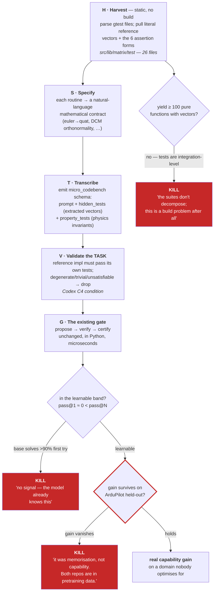

# Flight-control corpus — feeding PX4 / ArduPilot into the gym

*How to turn two real autopilot codebases into verified tasks, without building either of them.
Status: **designed, not built.** Every number below was measured on the local clones; every
obstacle named in §3 is one I raised against this idea myself and had to answer before writing it
down.*

---

## 1. The reframe that makes this possible

The obvious version of this idea does not work: *"clone the repo, run its tests, treat each bug
fix as a task."* PX4 and ArduPilot are large C++ projects needing cross-compilers and simulation.
Building them to check one patch takes minutes, which destroys **`verify ≪ solve`** — the
measurement Slice 1 rests on and the reason verified search is economic at all.

So don't treat them as codebases.

> **They are not a build target. They are a mine for two things: mathematical *specifications* of
> real flight-control routines, and *reference input/output vectors* from their existing test
> suites. Both are extractable statically, from source text, with no toolchain.**

Once framed that way the C++ never runs. We read it, harvest facts, and pose the task in Python —
where the existing gate already works, at milliseconds per check.

---

## 2. What is actually in there (measured)

```
72,468 commits | 9,946 fix-shaped |    40 test files | ardupilot     (GPLv3)
                                  | 2,141 test files | px4-autopilot (BSD-3-Clause)
```

The relevant subset is the pure-math libraries, not the firmware:

| Location | Files | Contents |
|---|---|---|
| `src/lib/matrix/test/` | 26 | quaternions, DCM, Euler, inverse, pseudo-inverse, least squares, integrals, filters |
| `src/lib/mathlib/math/test/` | 7 | numerical helpers |
| `src/modules/ekf2/test/` | 26 | state estimation (harder; later) |

**The assertions are literal reference vectors.** From `MatrixAttitudeTest.cpp`:

```cpp
Eulerf euler_check(0.1f, 0.2f, 0.3f);
Quatf  q_check(0.98334744f, 0.0342708f, 0.10602051f, .14357218f);
float  dcm_data[] = { 0.93629336f, -0.27509585f,  0.21835066f,
                      0.28962948f,  0.95642509f, -0.03695701f,
                     -0.19866933f,  0.0978434f,   0.97517033f };
```

That is a complete, exact, language-independent I/O triple for *euler → quaternion* and
*euler → DCM*. No compiler required to read it.

**And the assertion vocabulary is tiny** — six forms cover all 545 assertions in the matrix suite:

```
289 EXPECT_EQ      166 EXPECT_FLOAT_EQ      48 EXPECT_TRUE
 34 EXPECT_FALSE     6 EXPECT_NE             2 EXPECT_DOUBLE_EQ
```

A few hundred lines of parser reaches most of it. This is the single fact that makes the whole
plan cheap.

---

## 3. The three obstacles, and the answer to each

**Obstacle 1 — the verifier is Python, the source is C++.**
*Answer: never execute the C++.* Harvest the specification and the reference vectors, pose the
task in Python, verify with the existing gate. The C++ is documentation with unusually precise
examples.

**Obstacle 2 — `verify ≪ solve` breaks if you build the project.**
*Answer: we don't build it.* Checking a Python quaternion function against 12 extracted reference
vectors is microseconds — the same economics as the shipped CAS tasks. Confine the harvest to
**pure leaf functions**: no I/O, no hardware, no globals, no allocation, no time. That is exactly
what `src/lib/matrix` is.

**Obstacle 3 — commits are not clean tasks.**
*Answer: don't use commits.* This is where I first went wrong: "9,946 fix-shaped commits" is a
grep count, not a corpus. Extracting clean tasks from commit history is the SWE-bench problem — a
serious research effort that yielded ~2,300 usable tasks from twelve large Python repos. **Use the
test suites instead**, which are already isolated, already named, already carry their expected
values. Commit mining stays out of scope until the test-suite path has proven itself.

---

## 4. The licence rule (non-negotiable)

| Repo | Licence | Role |
|---|---|---|
| **PX4** | BSD-3-Clause — permissive | **training corpus.** Derived tasks are freely usable and redistributable. |
| **ArduPilot** | **GPLv3 — viral** | **held-out evaluation only.** Never enters training data. |

This is the same trap the main plan already refuses when it rejects the Gemma-licensed,
frontier-distilled path: a tainted input makes the *output* unshippable, which forfeits the whole
point of an Apache-2.0 base.

Two things make the split fortunate rather than merely cautious:

- **It gives you a genuinely independent test set.** ArduPilot is a different codebase with
  different conventions solving the same physics. A model that improves on PX4 tasks *and* on
  ArduPilot tasks has learned quaternions, not PX4.
- **Reference vectors are facts, not expression.** A numeric constant (`0.1, 0.2, 0.3` →
  `0.98334744, …`) is a mathematical fact; the copyrighted thing is the C++ source. Harvesting
  values is a far weaker exposure than vendoring code. *This is engineering reasoning, not legal
  advice — get a real opinion before shipping anything trained on either repo.*

Neither repo is ever vendored into this tree (see `.gitignore`). Clone outside, point the
harvester at a path.

---

## 5. The pipeline



---

## 6. You do not need a reference implementation

The natural assumption is that each task needs a `gold` — a Python translation of the C++ routine.
That assumption is expensive and wrong, and dropping it removes most of the risk:

- Hand-translating does not scale, **and produces a derivative work** — the licence problem, right
  back.
- Machine-translating makes the gold *unverified model output* — the trust problem, right back.

But look at what the gate actually consumes. `CodeTestVerifier` certifies **"passes every test."**
`gold` exists only for the zero-ML `NoisyProposer` baseline. A real proposer needs the *task* and
the *tests* — never the answer.

> **Harvest reference vectors and invariants. Not implementations.** The model writes the code from
> a specification; the extracted values decide whether it is right.

That sidesteps the derivative-work question almost entirely and removes an entire class of corpus
poisoning: there is no gold to be wrong.

**Two test tiers, both free:**

- **Hidden tests** — the extracted literal vectors. Exact, and the model has never seen this
  framing of them.
- **Property tests** — the physics invariants, which `verify/scientific.py` *already implements*:
  a DCM must be orthonormal with determinant 1, a quaternion must have unit norm, euler→quat→euler
  must round-trip, a rotation must preserve vector length. These are generated, not harvested — so
  they are uncontaminated by construction and cannot be memorised.

The property tier is the interesting one. It is the same trick as the symbolic forge: **invariants
are an infinite, self-generated test supply that no amount of pretraining exposure can leak.**

---

## 7. The biggest threat: contamination

PX4 and ArduPilot are on GitHub. They are in the pretraining data of every model you would use.
A model may reproduce `euler_to_quaternion` from memory, and you would measure recall and call it
capability — the exact error that already invalidates this repo's only writer result (the
in-sample FIM 2/11).

Take it seriously or the whole corpus is worthless:

1. **Reparameterise.** Rename functions and variables, change argument order, switch conventions
   (Hamilton ↔ JPL quaternions, ZYX ↔ XYZ euler order, radians ↔ degrees). Memorised code breaks;
   understanding survives.
2. **Lean on the property tier.** Generated invariants cannot be memorised.
3. **Cross-repo holdout.** Train on PX4, test on ArduPilot. Different code, same physics.
4. **Date-split** on functions added after the base model's cutoff, where feasible.
5. **Compare against the symbolic forge**, which is uncontaminated by construction. If flight tasks
   show a large gain and symbolic tasks show none, suspect recall.

Mitigations 1–3 are cheap. **None of them fully solves it**, and any result from this corpus must
be reported with that caveat attached.

---

## 8. Order of work

This corpus is **not** the next thing to build. The order is:

1. **Symbolic forge + train once** (`ROADMAP.md` S0–S3) — days, ~$0, uncontaminated, and it
   answers the only question that matters: *does training on verified tasks improve the model at
   all?*
2. **Only if that number moves**, build the harvester here. It is a few hundred lines against a
   six-form assertion grammar.

Building this first would mean investing in a domain corpus before knowing whether the loop works
— and if the loop doesn't work, the corpus is worthless regardless of how good it is.

---

## 9. What this does not do

- **It does not make the model good at flight control.** It makes it good at the *pure numerical
  routines underneath* flight control. Control-loop tuning, state estimation, and real-time
  behaviour are not reachable this way.
- **It does not use the 9,946 fix-shaped commits.** That is the SWE-bench problem and stays out of
  scope.
- **It does not touch the EKF suite yet.** `src/modules/ekf2/test` is 26 more files, but state
  estimation is stateful and not a pure leaf function — a later tier, if the first works.
- **It does not resolve the licensing question.** It gives a conservative rule (PX4 trains,
  ArduPilot evaluates only). Get a real opinion before shipping.
- **It does not escape the code path's trust problem.** These are executed Python tests, so they
  inherit the `judge_v1` residual and need the subordinate executor (`ROADMAP.md` S4) before any
  certificate is trustworthy. The symbolic slice does not — which is exactly why it goes first.
