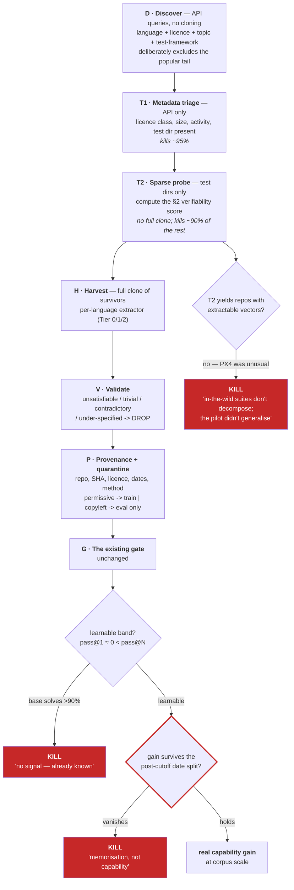

# The GitHub absorber — plan

*A system that finds, scores and ingests public repositories as verified-task sources. The
generalisation of [`FLIGHT_HARVESTER_PLAN.md`](FLIGHT_HARVESTER_PLAN.md) — build that one first,
learn the real yield rates, then generalise. Not the other way round.*

**Status: not started.** Sequenced last. See §8.

---

## 1. The inversion this whole thing rests on

Every data pipeline in the industry sorts repositories by stars, size, or activity. For a
verifier-grounded system that is close to exactly backwards.

> **A repo's value to UltraBrain is how cheaply and soundly its correctness can be checked —
> not how much code it contains, how popular it is, or how many bugs were fixed in it.**
>
> **The absorber is not looking for code. It is looking for verifiers in the wild.**

And the second, sharper inversion:

> **Popularity is an *anti*-signal.** A 50k-star repo is certainly in every base model's
> pretraining data, so a measured "gain" on it is probably recall. An obscure, well-tested
> numerical library is *worth more* — the model has likely never seen it, so the measurement is
> real.

So the absorber sorts **descending by verifiability, ascending by popularity**. That single
scoring choice is what separates this from a generic scraper, and it follows directly from the
project's own thesis: the verifier is the asset, and an unfalsifiable capability claim is worthless.

---

## 2. The verifiability score

Computed from metadata and a *sparse* checkout of test directories — never a full clone.

| Signal | Weight | Why |
|---|---|---|
| **Property-based tests present** (Hypothesis, QuickCheck, proptest, fast-check, jqwik) | **highest** | pre-built, generated invariants — uncontaminable, and the highest verifier grade in the zoo |
| **Literal reference vectors in assertions** | high | extractable facts (the PX4 finding) |
| **Doctest / docstring examples** | high | literally `(input, expected)` pairs, already machine-runnable |
| **Pure-function density** — no I/O, globals, network, clock, RNG | high | testable in isolation; keeps `verify ≪ solve` |
| **Unit-test granularity** (unit ≫ integration) | high | integration tests need infrastructure and break the economics |
| **Stated invariants** — conservation, unitarity, idempotence, round-trip, monotonicity | high | grade-1/2 verifiers, free |
| **Setup cost** — installable and testable without Docker/hardware/network | medium | a repo that needs a toolchain is not worth it |
| **Permissive licence** | **gate, not weight** | see §4 |
| **Stars / forks** | **negative** | contamination proxy |
| Repo size, commit count, contributor count | **zero** | irrelevant; classic vanity metrics |

**Language priority** follows testability, not popularity: pure Python/Rust/Go libraries first;
numerical C/C++ libraries second (harvest vectors, don't build); anything needing hardware,
network, or a browser is excluded.

---

## 3. Sources inside a repo, ranked by yield-per-effort

The user's question named commits, releases and fixes. Ranked honestly — and the ranking is *not*
the intuitive one:

| Tier | Source | Yield | Effort | Verdict |
|---|---|---|---|---|
| **0** | **Property-based tests** | high | very low | pre-built invariant checks. Take everything. |
| **1** | **Unit-test suites** | high | low | already isolated, already carry expected values. **The main course.** |
| **1** | **Doctests / docstring examples** | medium | very low | `(input, expected)` pairs by construction |
| **2** | **Fix commits that add a regression test** | high | medium | self-labelling — see below |
| **3** | **Releases / changelogs** | ~zero as tasks | low | **valuable for dating, not for tasks** — see below |
| **4** | Bare fix commits (no test) | low | high | the SWE-bench problem. **Skip.** |
| **5** | Issues, PR discussion, README prose | ~zero | high | skip |

**Tier 2 is the tractable slice of commit mining.** A commit whose diff touches **both**
`src/foo.py` **and** `tests/test_foo.py` is *self-labelling*: the added test is the verifier, the
parent commit is the broken state, and the diff is the answer — all three mechanically identifiable
by diff shape alone, with no LLM and no semantic understanding.

That is the ~small fraction of "fix-shaped commits" that is actually usable, and being explicit
that we take **only** the mechanically-detectable slice is what keeps this from becoming the
open-ended research project it looks like. Validation is free and strong: **the added test must
fail at the parent commit and pass at the fix commit.** If it doesn't, the commit is mislabelled —
drop it, no judgement call required.

**Tier 3 reframed.** Releases are nearly worthless as tasks and *quietly valuable* for something
else: **release dates give a clean contamination split.** Anything first released after a base
model's training cutoff cannot have been memorised. So the absorber ingests release metadata to
build **date-partitioned evaluation sets** — the cheapest honest holdout available, and the fix
for the exact flaw (in-sample measurement) that currently invalidates this repo's only writer
result.

---

## 4. Licence handling — a gate, not a score

| Licence | Class | Use |
|---|---|---|
| MIT, BSD, Apache-2.0, ISC, Unlicense, CC0 | `permissive` | **training corpus** |
| GPL, LGPL, AGPL, MPL, SSPL | `copyleft` | **evaluation only — quarantined** |
| **No licence file** | `none` | **excluded entirely** — no licence means all rights reserved |
| Unrecognised / ambiguous | `unknown` | **excluded** — abstain, never assume |

Enforced **in code**: every task carries `licence_class`, and the trainer refuses to load anything
that is not `permissive`. Not a comment, not a convention — a load-time check with a test.

The rule follows the main plan's own logic for rejecting the Gemma-licensed distilled path: a
tainted input makes the *output* unshippable, forfeiting the point of an Apache-2.0 base. Note also
that extracted *reference values* are mathematical facts while source code is expression — a
meaningfully weaker exposure. *That is engineering reasoning, not legal advice; get a real opinion
before shipping anything trained on absorbed data.*

**Conduct rules, not optional:** use the GitHub API (never scrape), respect rate limits and
`robots.txt`, identify the client honestly, cache aggressively to avoid re-fetching, and never
republish upstream source — only derived tasks plus attribution.

---

## 5. Architecture — a funnel, because you cannot clone GitHub

~400M public repos. Every stage must be cheaper than the one after it.

**Shape:** `ultrabrain/absorb/` gains `discover.py`, `score.py`, `extract/{pytest,doctest,property,gtest,diff}.py`,
sharing `validate.py` / `provenance.py` with the flight harvester. `gtest.py` from the pilot becomes
one extractor among several — which is the test of whether the pilot generalised.

---

## 6. Failure modes to design against

- **Volume mistaken for value.** A million scraped tasks that are trivial, contaminated or
  unverifiable is *worse* than a thousand good ones: it hides the signal and inflates the
  confidence. Report yield **after** validation, never before. (This is the error I made when I
  reported "9,946 fix-shaped commits" — a grep count presented as a corpus.)
- **Silent truncation.** Every stage logs what it dropped and why. A funnel that quietly discards
  90% reads as "we covered GitHub" when it covered a biased sliver.
- **Monoculture.** Scoring by verifiability selects for numerical/algorithmic libraries — the model
  gets narrower while the corpus looks bigger. Track domain diversity explicitly.
- **Contamination laundering.** Absorbing a repo that itself vendored a popular library
  reintroduces memorised code under a new name. Deduplicate by content hash, not repo name.
- **Licence drift.** Repos relicense. Record the licence *at the harvested SHA*, and re-check
  before any release.

---

## 7. What this does not do

- **It does not solve unverifiable domains.** No verifier, no task. Prose, taste and world
  knowledge stay out of reach (`BECOMING_AN_LLM.md` §2, Ceiling 3).
- **It does not do general commit mining.** Tier 2's diff-shape filter only. Tier 4 stays out.
- **It does not escape the code path's trust problem.** Absorbed tasks are executed tests, so they
  inherit the `judge_v1` residual and need the subordinate executor (`ROADMAP.md` S4) before any
  certificate is trustworthy.
- **It does not remove the need for the symbolic forge.** The forge is uncontaminated *by
  construction*; absorbed data never can be. The forge stays the clean control against which
  absorbed-data results are read.

---

## 8. Sequencing — this is last, deliberately

1. **Symbolic forge + one training run** (`ROADMAP.md` S0–S3) — days, ~$0, uncontaminated.
   *Does training on verified tasks improve the model at all?*
2. **Flight harvester** (`FLIGHT_HARVESTER_PLAN.md`) — 1–2 weeks. The pilot: one repo, one
   language, known-good suite. Learn the real yield rates.
3. **This absorber** — generalise the pilot's extractors across languages and repos.

Building the absorber first would mean writing a discovery-and-scoring pipeline before knowing
whether *any* absorbed task teaches a model anything — and if step 1 fails, steps 2 and 3 are
worthless however well engineered. The whole point of the kill gates is to reach that answer for
about $0.
