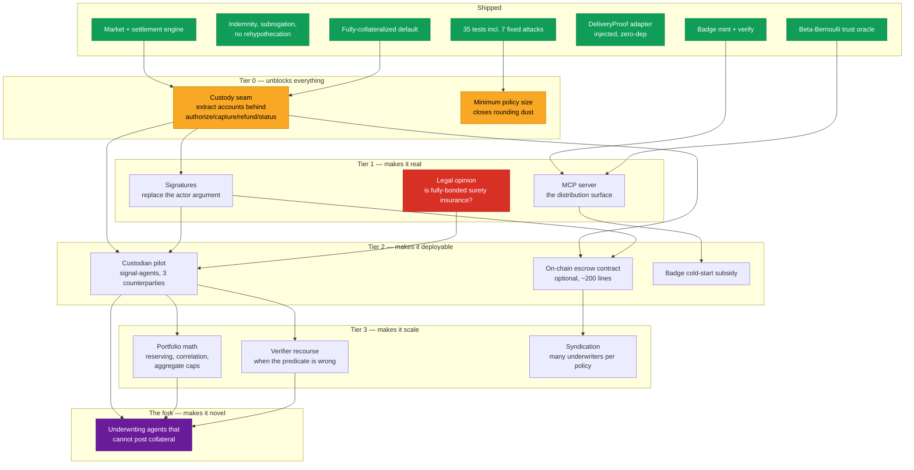

# vouch — roadmap

Status as of 2026-07-27. The concept is complete; the product does not exist.
This file is the dependency graph between here and something that could hold
real money, plus the one fork that decides whether this is a port of an old
instrument or a new one.

## The graph

**Critical path:** `Custody seam → Signatures → Legal opinion → Pilot`.
Everything else is parallel or optional.

**The one hard gate:** `Legal opinion` is red because a "no" answer — *this is
insurance* — means the pilot needs an authorised insurance undertaking, and the
whole shape changes. Get that answered before building toward a pilot, not
after.

## The work

| # | Item | Size | Blocked by | Why it matters |
| --- | --- | --- | --- | --- |
| A1 | **Custody seam** | S | — | Accounts live in an in-memory `Map`. Extract `deposit/lock/unlock/payFromLocked/transfer` behind DeliveryProof's existing rail interface. Does not touch the economics. Nothing real happens until this lands. |
| A2 | **Minimum policy size** | XS | — | Codex finding 7, unfixed. Premiums `ceil` upward, so 100 policies of exposure 1 cost more in aggregate than one of exposure 100. A floor closes it. |
| B1 | **Signatures** | M | A1 | Authorization is currently "pass the right name as an argument". Honest for a simulation, useless against an adversary. Every `open`/`bind` check becomes a signature check. |
| B2 | **MCP server** | M | — | **The README calls vouch an MCP sidecar and there is no MCP server.** The entire self-promotion story routes through MCP, so this is the gap between the distribution claim and reality. Expose: quote, bind, settle, score, badge. |
| B3 | **Legal opinion** | — | — | One question to a Dutch financial-services lawyer: *does a fully-bonded, subrogated performance guarantee where the obligor funds its own payout constitute insurance under Solvency II?* That single answer decides weekend project vs. licensed entity. |
| C1 | **Custodian pilot** | L | A1, B1, B3 | OpenCode's wedge: signal-agents for small trading desks. Fee $5–25/call, exposure $5k–50k/trade, premium 30–100 bps. One custodian holds USDC. Kill criterion: cannot land 3 paying counterparties in 30 days. |
| C2 | **On-chain contract** | M | A1, B1 | Only needed for permissionless underwriting. Escrow-and-lock on an existing chain. Not an L1, not an L2, not a token. |
| C3 | **Badge cold-start subsidy** | S | B2 | OpenCode's finding: a vouch badge costs locked capital and a recurring premium, unlike a free TLS padlock. The loop needs ~10 subsidised agents displaying badges *before* buyers are asked to recognise one. |
| D1 | **Portfolio math** | L | C1 | Prices one policy, silent on a book. No reserving, no correlation limits, no aggregate exposure caps. Grok's "what a real underwriter would demand". |
| D2 | **Verifier recourse** | M | C1 | Settlement assumes the predicate is correct and well-defined. When it is neither, there is no path. Probably: a challenge window with re-execution, never a vote. |
| D3 | **Syndication** | M | C2 | One underwriter per commitment today. Real capacity needs many, which needs pro-rata payout and subrogation splitting. |
| E1 | **Uncollateralized underwriting** | XL | C1, D1, D2 | See below. |

## The fork

Everything above turns vouch into a working, honest, *derivative* product —
Grok's audit verdict, which stands on the merits. Surety is Roman, subrogation
is 19th-century marine insurance, actuarial credibility scoring is standard.

The unclaimed territory is the thing this design explicitly refuses to solve:

> **How do you underwrite an agent that cannot post collateral?**

That is where the volume is — unknown agents are exactly the ones needing cover
they cannot bond. It is collusion-exposed by construction, which is why the
current default refuses it. Nobody has cracked it.

Three angles that have not been tried here:

1. **Franchise value as collateral.** An agent's future earnings are worth
   something. Bond against expected future premium income rather than present
   capital, and slash the earning stream instead of a deposit.
2. **Correlated identity cost.** Make Sybil identities expensive by making
   reputation *portable but non-splittable* — an agent's history is worth more
   in one identity than divided across ten.
3. **Mutualisation.** Agents underwrite each other in a pool where defection is
   detectable across the group, not per-policy. This is how P&I clubs solved
   exactly this problem for shipowners who could not individually bond.

Angle 3 is the most promising and the most researched historically, which is
both a reason to try it and a reason to expect it is also derivative.

**Decision needed:** ship the honest port (A1 → C1) or spend the effort on E1.
They are not sequential — E1 changes what the product *is*, so doing it after a
pilot means rebuilding. Doing it first means no pilot for a long time.

## Not doing

Recorded so they stay decided rather than relitigated:

- **A new chain, L1, L2, or token.** The verifier, oracle, badge and pricing
  need no consensus, because there is no adjudication step. Only money-holding
  needs a venue, and existing ones work.
- **Governance-decided claims.** The entire distinction from Nexus Mutual and
  its descendants is that settlement is re-executable by anyone. A vote would
  delete the one property worth having.
- **Reputational cover on by default.** Three independent lenses — economic,
  legal, prudential — converge on fully-collateralized. Available via
  `allowReputational: true` for anyone who wants the exposure knowingly.
- **Tokenising the policy.** Makes it a tradeable derivative, which is MiFID II
  rather than MiCA. Worse, not better.
